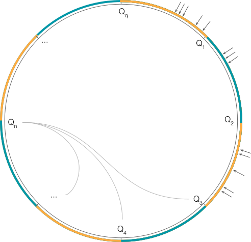

<p align="center">
  
  <h3 align="center">ring</h3>
  <p align="center"><strong>consistent hashing data structure</strong></p>

  <p align="center">
    <!-- Version -->
    <a href="https://github.com/fogfish/ring/releases">
      
    </a>
    <!-- Documentation -->
    <a href="https://pkg.go.dev/github.com/fogfish/ring">
      
    </a>
    <!-- Build Status  -->
    <a href="https://github.com/fogfish/ring/actions/">
      
    </a>
    <!-- GitHub -->
    <a href="http://github.com/fogfish/ring">
      
    </a>
    <!-- Coverage -->
    <a href="https://coveralls.io/github/fogfish/ring?branch=main">
      
    </a>
    <!-- Go Card -->
    <a href="https://goreportcard.com/report/github.com/fogfish/ring">
      
    </a>
  </p>
</p>

---

>
> One Ring to rule them all, One Ring to find them,
>
> One Ring to bring them all and in the darkness bind them...
>

The type `ring` implements consistent hashing data structure to orchestrate the topology without the global coordinator in the distributed environment. The library is developed after [Erlang's consistent hashing data structure](https://github.com/fogfish/datum/blob/master/src/sets/ring.erl), which has been battle tested by author in various contexts. 

## Inspiration

The concept of [consistent hashing](https://en.wikipedia.org/wiki/Consistent_hashing) has been developed in the past to deal with load-balancing in a dynamic environment. It solves the resizing problem of traditional mod-n hashing technique so that only the k/N fraction of keys needs to be reallocated when topology is modified, while the traditional hashing causes entire remapping of key space. The practical adoption of consistent hashing into distributed systems has shown a need for stricter balancing of keys, therefore hashing schema has been enhanced with the concept of virtual nodes. In this schema, each node claims randomly multiple tokens. The tokens of all nodes are placed on the ring according to their values. Every two consecutive tokens frame the arc, which is claimed by the corresponding node. Virtual node partitioning schema works well for load balancing of CPU bound workload but suffers for storage bounded workload due to the randomness in key ranges as it has been [demonstrated by Amazon Dynamo](https://www.allthingsdistributed.com/files/amazon-dynamo-sosp2007.pdf). Virtual nodes do not guarantee determinism on key range reallocation when topology is modified nor predictability of anti-entropy processes. 

The ultimate consistent hashing uses unrelated algorithms for **partition**, **allocation** and **routing**. The hash address space `2ᵐ-1` is divided into Q equally sized shards. Each node claims about Q/N shards with the help of T pseudo-randomly assigned tokens. The tokens are mapped into the hash address space to claim governance of shards to the node. When a node leaves the system, its shards are consistently distributed to the remaining nodes. Similarly, when a node joins the system it "steals" shards from nodes in the system in consistent ways. The request routing procedure maps the key into the hash space to determine the shard and corresponding node.

See [details about the data structure and algorithm](./doc/consistent-hashing-the-rings-of-power-2.pdf).

## Installing 

The latest version of the library is available at `main` branch. All development, including new features and bug fixes, take place on the `main` branch using forking and pull requests as described in contribution guidelines. The stable version is available via Golang modules.

1. Use `go get` to retrieve the library and add it as dependency to your application.

```bash
go get -u github.com/fogfish/ring
```

2. Import it in your code

```go
import (
  "github.com/fogfish/ring"
)
```

## Quick Example

Here is a minimal example on creating an instance of the ring, assembling topology from individual nodes and then routing the requests. See the full [example](examples/ringo.go) 

```go
package main

import (
  "github.com/fogfish/ring"
)

func main() {
  /*
    create new ring instance with m=64, Q=8, T=8
  */
  ringo := ring.New(ring.WithM64(), ring.WithQ(8), ring.WithT(8))

  /*
    when all nodes join the topology is following

    ring: m=64, q=8, t=8
    |     [0, ffffffffffffffff]
    |     [ 18.54.73.101 113.181.90.103 102.190.90.78 140.93.207.103 92.106.122.149 ]
    |
    |     0: 1fffffffffffffff ⇒     1  ab26472ec2ed62a [18.54.73.101]
    |     1: 3fffffffffffffff ⇒     0 228ad527296bd2d5 [113.181.90.103]
    |     2: 5fffffffffffffff ⇒     2 5949b7cc2ac07642 [140.93.207.103]
    |     3: 7fffffffffffffff ⇒     3 6c13f457b56728ec [18.54.73.101]
    |     4: 9fffffffffffffff ⇒     0 931fb3cd1fc272eb [18.54.73.101]
    |     5: bfffffffffffffff ⇒     0 a22176d726c38cb5 [102.190.90.78]
    |     6: dfffffffffffffff ⇒     1 d613972f28795b25 [140.93.207.103]
    |     7: ffffffffffffffff ⇒     0 f27d0004a29a8dff [140.93.207.103]
  */
  ringo.Join("113.181.90.103")
  /* ... */
  ringo.Join("18.54.73.101")

  /*
    Lookup successor nodes for the key.
    It returns list of primary & handoff nodes

    Primary:
    1. {ffffffffffffffff | 0 - 140.93.207.103}
    2. {ffffffffffffffff | 1 - 18.54.73.101}
    3. {ffffffffffffffff | 0 - 113.181.90.103}

    Handoff:
    - empty
  */
  primary, handoff := ringo.SuccessorOf(3, "One ring to rule them all")

  // Handoff node and its shards to other
  ringo.Handoff("18.54.73.101")

  // Permanently leaves the topology
  ringo.Leave("18.54.73.101")
}
```

## How To Contribute

The library is [Apache 2.0](LICENSE) licensed and accepts contributions via GitHub pull requests:

1. Fork it
2. Create your feature branch (`git checkout -b my-new-feature`)
3. Commit your changes (`git commit -am 'Added some feature'`)
4. Push to the branch (`git push origin my-new-feature`)
5. Create new Pull Request


The build and testing process requires [Go](https://golang.org) latest version.

**Build** and **run** in your development console.

```bash
git clone https://github.com/fogfish/ring
cd ring
go test
go test -run=^$ -bench=. -cpu 1
```

### commit message

The commit message helps us to write a good release note, speed-up review process. The message should address two question what changed and why. The project follows the template defined by chapter [Contributing to a Project](http://git-scm.com/book/ch5-2.html) of Git book.

### bugs

If you experience any issues with the library, please let us know via [GitHub issues](https://github.com/fogfish/ring/issue). We appreciate detailed and accurate reports that help us to identity and replicate the issue. 

## License

[](LICENSE)